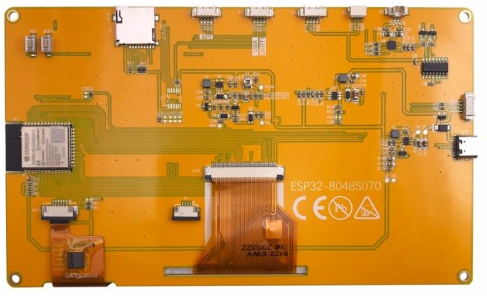
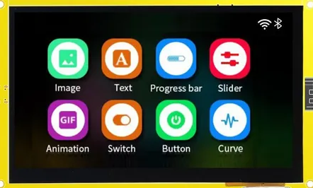
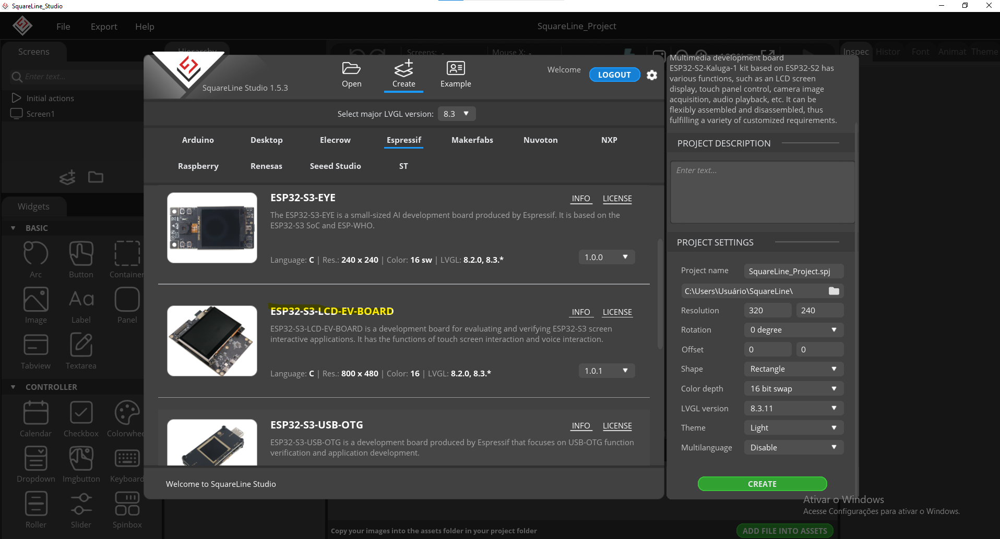
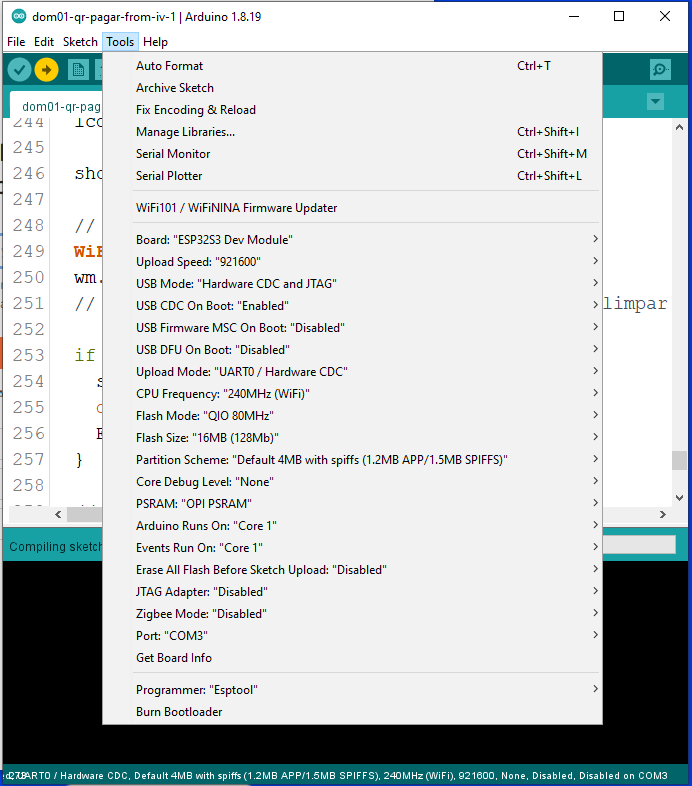

# ESP32-S3 + Sunton 7" RGB (800×480) — Setup Guide

> **Modelo do display**: Sunton **ESP32-8048S070** (7", 800×480, RGB)

---

## 1) Core do ESP32 (versão exigida)

1. Abra o **Arduino IDE**  
2. Vá em **Tools → Board → Boards Manager…**  
3. Pesquise **esp32 (Espressif Systems)**  
4. Selecione a versão **`2.0.14`** → **Install**  
5. Em **Tools → Board**, selecione **ESP32S3 Dev Module**

---

## 2) Bibliotecas necessárias (versões fixas)

Instale em **Sketch → Include Library → Manage Libraries…**:

- **WiFiManager** — autor *tzapu* — **`0.16.0`**
- **lvgl** — autor *kisvegabor* — **`8.3.11`**
- **LovyanGFX** — **`1.2.7`**
- Touch Screen (Library Name: TAMC_GT911
https://github.com/TAMCTec/gt911-arduino/archive/refs/heads/main.zip)

> Use exatamente essas versões para evitar incompatibilidades.

---

## 3) Copiar configuração do LVGL

Copie o arquivo de config do projeto para a pasta de bibliotecas do Arduino:

- **Origem**: `PixPayApp/lv_conf.h`  
- **Destino (Windows)**: `C:\Users\<SEU_USUARIO>\Documents\Arduino\libraries\lv_conf.h`  
- **Destino (macOS)**: `~/Documents/Arduino/libraries/lv_conf.h`  
- **Destino (Linux)**: `~/Arduino/libraries/lv_conf.h` *(ou)* `~/Documents/Arduino/libraries/lv_conf.h`

> Se não existir a pasta `libraries`, crie. Se já houver um `lv_conf.h`, substitua pelo seu.

---

## 4) Configurações recomendadas em **Tools** (ESP32-S3)

- **CPU Frequency**: `240 MHz`  
- **PSRAM**: `OPI PSRAM` / `Enabled` *(se disponível)*  
- **Flash Mode**: `QIO 80 MHz`  
- **Partition Scheme**: `Default 4MB with spiffs (1.2MB APP/1.5MB SPIFFS)`  
- **USB CDC/JTAG**: conforme sua placa (Hardware CDC geralmente OK)

> Essas opções são típicas para o **Sunton ESP32-8048S070**.

---

## 5) Compilar & Enviar

1. Conecte a placa e escolha a **porta** em **Tools → Port**  
2. **Sketch → Verify/Compile**  
3. **Sketch → Upload**

---

## 6) Notas sobre o Display (LovyanGFX)

- Painel **RGB 800×480**, sincronismo via pinos `henable/hsync/vsync/pclk`  
- Mantenha a configuração do **LovyanGFX 1.2.7** (pinos e porches) compatível com seu hardware Sunton  
- Ajustes comuns no painel (exemplo):
  - `freq_write = 24000000`
  - Porches típicos:  
    - `hsync_front_porch = 40`, `hsync_pulse_width = 48`, `hsync_back_porch = 88`  
    - `vsync_front_porch = 13`, `vsync_pulse_width = 3`, `vsync_back_porch = 32`

---

## 7) Checklist Rápido

- [ ] **Core ESP32 2.0.14** instalado  
- [ ] **WiFiManager 0.16.0** instalado  
- [ ] **lvgl 8.3.11** instalado  
- [ ] **LovyanGFX 1.2.7** instalado  
- [ ] `lv_conf.h` copiado para a pasta `Arduino/libraries/`  
- [ ] Board selecionada: **ESP32S3 Dev Module**  
- [ ] PSRAM habilitada (se aplicável)

---

## 8) Troubleshooting

- **Erros de compilação do LVGL**: verifique se o `lv_conf.h` certo está em `Documents/Arduino/libraries/` e se a versão do LVGL é **8.3.11**.  
- **Tela sem imagem**: revise os pinos e porches no seu config do **LovyanGFX** e a rotação do painel.  
- **PSRAM**: se faltar memória, ative PSRAM em **Tools** e evite buffers gigantes no sketch.  
- **Mensagens de core dump no boot**: não costumam impedir a execução; se incomodar, desative *Core Dump* nas opções da placa ou faça *Erase Flash*.

---

## Galeria (imagens do repositório)

> As imagens abaixo devem estar no mesmo diretório do `.md` (arquivos: `1.png`, `2.png`, `3.png`, `4.png`).

<table>
  <tr>
    <td align="center"> 1.png</td>
    <td align="center"> 2.png</td>
  </tr>
  <tr>
    <td align="center"> 3.png</td>
    <td align="center"> 4.png</td>
  </tr>
</table>
